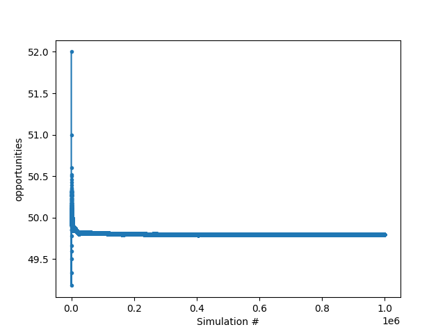
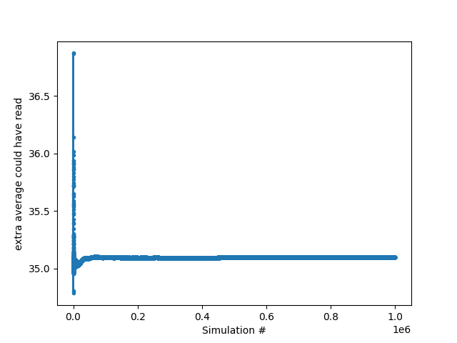
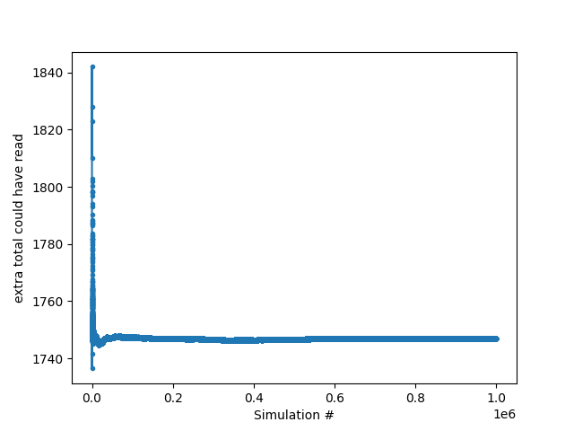
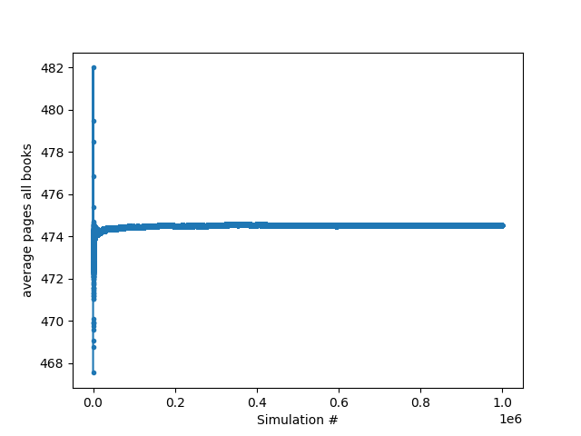
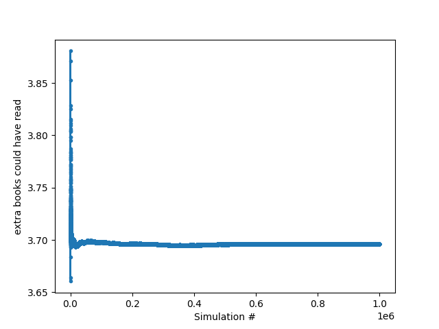
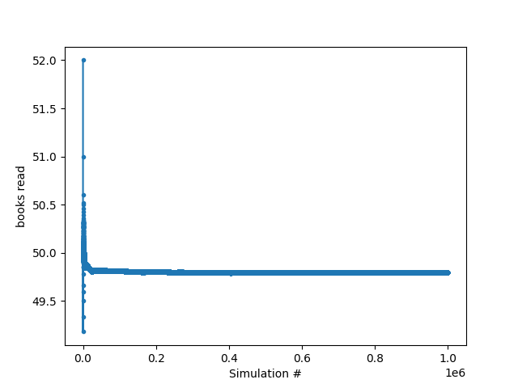

# Simulation results

## Parameters

**Books generated**: 100

**Days**: 365

**Daily Pages**: 70

**Simulations**: 1000000

## Results

**opportunities**: 49.797598

**extra_average_could_have_read**: 35.096979132303645

**extra_total_could_have_read**: 1746.858987

**average_pages_all_books**: 474.51848967000416

**extra_books_could_have_read**: 3.696263673535351

**books_read**: 49.797598

